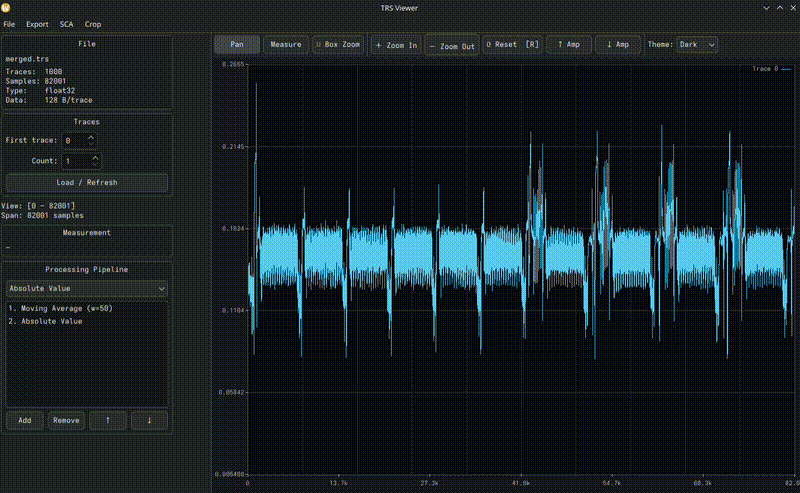

# trs-viewer

<p align="center">
  
</p>

Interactive power-trace viewer and side-channel analysis toolkit for Riscure `.trs` files and NumPy trace sets.


---

## Contents

- [Features](#features) — [Trace Viewing](#trace-viewing) · [Processing Pipeline](#signal-processing-pipeline) · [Alignment](#trace-alignment) · [T-Test](#welch-t-test) · [Cross-Correlation](#cross-correlation-matrix) · [CPA](#correlation-power-analysis-cpa) · [SNR](#signal-to-noise-ratio) · [Static SNR](#static-snr) · [FFT](#fft-spectrum) · [Heatmap](#heatmap-viewer) · [Export TRS/NPY/NPZ](#export-trs--npy--npz) · [Export Dataset](#export-dataset) · [Range Editor](#range-editor) · [Chain Editor](#chain-editor) · [NPY/NPZ](#npy--npz-support)
- [File Formats](#file-formats) — [TRS](#trs-riscure-trace-set) · [NPY](#npy) · [NPZ](#npz)
- [Dependencies](#dependencies)
- [Installation](#installation) — [Linux](#linux) · [Windows (WSL)](#windows-via-wsl) · [macOS](#macos)
- [Usage](#usage)
- [Project Layout](#project-layout)

---

## Features

### Trace Viewing

- Load `.trs` power-trace files (Riscure format) **or** NumPy `.npy` / `.npz` trace matrices
- Multi-trace overlay with 8 distinct colours
- Pan · box-zoom · distance-measurement interaction modes
- **Y-axis zoom** — Ctrl+scroll (or Shift+scroll) to compress/expand amplitude
- Dark and light themes
- **Multiple datasets at once** — every opened file gets its own tab. Drag tabs to reorder them, or hit **⬒ Tile Tabs** to show them side by side and compare traces across files
- **Stacked view** (**☰ Stack**) — draw each trace in its own non-overlapping lane instead of overlaying them all; independent of the interaction mode
- **Undo** (Ctrl+Z) — steps back through pipeline edits, alignment and trace-range changes
- Crop ranges — mark sample regions and export as a new `.trs` file (see [Range Editor](#range-editor))

The side panel shows file metadata (trace count, samples/trace, sample type, data bytes/trace) and a **per-trace data inspector** — use the spin box to step through traces and see their auxiliary data bytes as a hex dump. If no data bytes are present, the inspector shows `(no data)`. When the file carries the optional `LEGACY_DATA` parameter (see below), the bytes are decoded automatically as `PT` / `CT` pairs.


### Signal Processing Pipeline

Transforms stack in order and are applied live on every render and on all SCA computations:

| Transform | Parameters | Description |
|---|---|---|
| Absolute Value | — | `\|x\|` point-wise |
| Negate | — | `-x` point-wise |
| Offset | constant | Add a constant to every sample |
| Scale | factor | Multiply every sample |
| Moving Average | window size | Causal sliding-window mean. The first `window − 1` output samples are a startup transient and are skipped when resetting the view |
| Window Resample | window size, overlap | Sliding-window mean advancing by `hop = window × (1 − overlap)`. `overlap = 0` is plain non-overlapping block decimation; `overlap → 1` makes consecutive windows nearly identical (hop is clamped to ≥ 1) |
| Stride Resample | stride | Keep every N-th sample — output is `ceil(N / stride)` samples |
| FFT Magnitude | window function | One-sided amplitude spectrum, `N/2 + 1` bins. Normalised by `N` with non-DC/Nyquist bins doubled, so the output is in the same amplitude units as the input |
| STFT Magnitude | window size, hop *or* overlap, window function | Short-Time Fourier Transform — each window's spectrum concatenated, giving `num_windows × (window/2 + 1)` samples. Intended for frequency-domain CPA |
| Gaussian Noise | relative σ | Adds i.i.d. `N(0, (σ × trace_std)²)`. σ is *relative* to each trace's own standard deviation, so the effect is scale-independent across trace sets |
| Biquad Filter | type, cutoff, Q | 2nd-order IIR filter (RBJ "Audio EQ Cookbook" formulas, Direct Form II Transposed). Types: lowpass · highpass · bandpass · notch |

**Window functions** (FFT and STFT): Rectangular · Hann · Hamming · Blackman.

**Biquad cutoff is normalised** — it is a fraction of Nyquist in `(0, 1)`, not Hz, because TRS files do not reliably carry a real sample rate. `0.1` means "10 % of Nyquist"; on a 1 GS/s capture that is 50 MHz, but the filter only ever sees the ratio. For lowpass/highpass, `Q ≈ 0.707` is the maximally-flat Butterworth response; for bandpass/notch, higher Q means a narrower band.

Transforms that carry state between samples (moving average, both resamplers, the filter, FFT/STFT) are marked *sequential* internally and force the renderer to read samples in order rather than striding.

### Trace Alignment

**SCA → Align Traces…**

Align a set of traces to a reference using one of two methods:

| Method | Description |
|---|---|
| **Cross-correlation** | Finds the shift that maximises the normalised cross-correlation with the reference trace |
| **Peak alignment** | Aligns the highest-amplitude peak of each trace to the reference peak |

Configure:

| Setting | Meaning |
|---|---|
| **First trace / Count** | The set of traces to align |
| **Reference trace** | Absolute trace index used as the alignment template |
| **Reference region first / length** | The window *within* the reference that is matched against, in pipeline-processed samples |
| **Search half-window ±** | How far each trace may be shifted while searching |
| **Peak mode** | For peak alignment: absolute max `\|v\|` or signed max |
| **Discard below correlation** | Optionally drop traces whose best correlation falls under a threshold |
| **Output mode** | Full trace padded with the trace average · full trace padded with zeros · crop to the common range |

Results are shown in a table and previewed in a separate plot. Click **Apply to Main View** to bake the aligned traces into the main display, or **Un-apply Shifts** to return to the live file-backed view — the computed shifts are kept for later reuse either way.

Alternatively, use the **↔ Align** drag mode in the main toolbar — drag any trace left or right to manually shift it one sample at a time.

Once alignment is applied (either method), the stored shifts are available to all SCA tools. Every SCA dialog shows an **"Apply last alignment shifts"** checkbox (pre-ticked when shifts are available) that locks the trace/sample range to the aligned values and applies per-trace shifts during analysis. Alignment state is automatically cleared when a new file is loaded or the trace set is changed.

### Welch T-Test

**SCA → Run Welch T-Test…**

Computes the per-sample Welch t-statistic between two trace groups. No special header fields are required — group assignment is configured in the dialog by choosing which data byte to use as the group label (0 = group 0, non-zero = group 1). If the file's parameter map contains a `ttest` entry, its `offset` field is used automatically and the byte selector is hidden.

**Result dialog features:**
- Adjustable ±threshold line (orange dashed)
- **One-sided mode** — show only the positive threshold (for abs-preprocessed signals)
- **Calc TH…** — significance-threshold calculator. The per-sample level for an overall type-I error rate α over `n_L` samples uses the **Šidák** correction `α_TH = 1 − (1 − α)^(1/n_L)`, and the threshold is `TH = CDF_t⁻¹(1 − α_TH/2, ν̂)` with Welch–Satterthwaite degrees of freedom computed from the trace data. The dialog reports both the median and approximate ν̂. Follows Zhang, Ding, Durvaux, Standaert & Fei, *Towards Sound and Optimal Leakage Detection Procedure* (IACR ePrint 2017/287, EuroS&P 2018)
- **Style…** — set plot title, line width, trace colour, dark/light theme
- **Export PDF…** — A4 landscape vector PDF
- Export result as `.npy` or `.trs`

**SCA → Load T-Test NPY…** — load a pre-computed 1-D `float32` t-statistic vector.


### Cross-Correlation Matrix

**SCA → Cross-Correlation…**

Computes the M×M normalised Pearson correlation matrix `C[i,j] = Corr(sᵢ, sⱼ)`, or a rectangular search×ref matrix for template matching.

| Method | Description |
|---|---|
| **Baseline** | Streaming rank-1 outer-product updates |
| **Dual Matrix** | Gram `G = AᵀA / M` → eigen-reconstruction |
| **MP-Cleaned** | Dual Matrix + zeroes eigenvalues ≤ λ₊ (Marchenko-Pastur noise edge) |
| **Two-Window** | Rectangular search×ref cross-correlation for template matching |

A **stride** parameter subsamples before computing (`M = ⌈samples / stride⌉`) to reduce memory and computation time.



### Correlation Power Analysis (CPA)

**SCA → CPA…**

CPA correlates a user-defined leakage model with every sample column of the trace matrix and ranks the results across M hypotheses. The correlation engine uses an online accumulator — the full trace matrix is never held in RAM, making it practical for large trace sets.

**Configuration:**
- Trace range and sample range
- **M (hypotheses)** — number of key guesses to test (1–65536); for AES key byte attacks use 256, for direct data correlation set M to the data field length
- **Alignment** — apply stored alignment shifts

**Leakage model editor:**
- Python code editor with syntax highlighting and boilerplate (AES S-box + Hamming weight)
- **Test Model** — runs the model against the loaded trace data and shows the output; CPA can only be launched after a successful test
- **Load / Save** — import or export `.py` model files
- **Model library** — persistent library at `~/.local/share/trs-viewer/models/`; use the **Library** drop-down to load saved models, **Save to library…** to store new ones

Model function signature:
```python
def get_leakages(data: np.ndarray, hypothesis: int) -> np.ndarray:
    """
    data       — uint8 array, shape (n_traces, data_length)
    hypothesis — current key hypothesis (0 .. M-1)
    returns    — float32 array, shape (n_traces,)
    """
```

For direct data correlation (no key model), set M to the data field length and use `hypothesis` as a byte index:
```python
def get_leakages(data, hypothesis):
    return data[:, hypothesis].astype(np.float32)
```

For LEGACY_DATA files (PT+CT in 32 bytes), correlate against plaintext byte `b` by setting M = 16 and indexing into the first half:
```python
def get_leakages(data, hypothesis):
    # hypothesis = byte index 0..15 into plaintext
    return data[:, hypothesis].astype(np.float32)
```
Or against ciphertext (offset 16):
```python
def get_leakages(data, hypothesis):
    return data[:, 16 + hypothesis].astype(np.float32)
```

**Result window:**
- Heatmap of the M × N_samples correlation matrix
- **Top candidates** table — ranked by peak |r|, showing hypothesis value, hex (M ≤ 256), peak correlation, and sample index

### Signal-to-Noise Ratio

**SCA → SNR…**

Per-sample SNR — `SNR[s] = Var(E[T[s] | class]) / E[Var(T[s] | class)]` — computed with an online accumulator, so trace count is not bounded by RAM.

Class labels are derived from one auxiliary data byte:

| Class mode | Classes |
|---|---|
| Raw byte value | 256 (0–255) |
| Hamming weight | 9 (0–8) |
| AES S-box output | 256 |
| AES S-box output — Hamming weight | 9 |

The two S-box modes take a **key byte hypothesis** and label each trace by `S-box(data_byte ⊕ key)`, so a correct hypothesis produces a sharper SNR peak. Requires a file with per-trace data bytes.

Accumulator memory is `2 × classes × samples × 8` bytes; the dialog estimates it up front and asks before allocating anything large.

### Static SNR

**SCA → Static SNR |μ/σ|…**

Per-sample `|mean / standard deviation|` across the selected traces — no class labels and no data bytes required. A quick way to see which regions of a trace carry stable structure versus noise. The result window reports min/max/average and exports to `.npy` or PDF.

### FFT Spectrum

**SCA → FFT Spectrum…**

Averaged one-sided spectrum over a range of traces.

| Setting | Options |
|---|---|
| **Window function** | None (rectangular) · Hann · Hamming · Blackman |
| **Output** | Magnitude · Magnitude (dB) · Phase (rad) |
| **Min/max envelope** | Overlay the per-bin minimum and maximum alongside the average |

Unlike the *FFT Magnitude* pipeline transform — which replaces the traces themselves so downstream SCA runs in the frequency domain — this is a read-only measurement view.

### Heatmap Viewer

Interactive false-colour heatmap for correlation matrices:

- Pan (drag) · zoom (scroll wheel)
- Adjustable colour range
- **Colour schemes**: RdBu · Grayscale · Hot · Viridis · Plasma · Lukasz
- **Gaussian blur** for pattern smoothing
- **Abs value** mode and **binary threshold** on `|v|`
- Export as PNG or `.npy`

### Export (TRS / NPY / NPZ)

**Export → Export TRS… / Export traces as NPY… / Export traces as NPZ…**

Each writes out the currently-configured pipeline applied to a chosen trace range:

- **Export TRS** preserves the source file's original sample coding — an `int16` file re-exported after processing stays `int16` (rounded and clamped to range, rather than silently forced to `float32` and doubling in size). NPY/NPZ are always `float32`, per the format.
- **Apply last alignment shifts** — shown whenever the active dataset has a stored alignment (from [Trace Alignment](#trace-alignment) or a Chain's Align step), ticked by default. Each trace is read with its stored shift applied and zero-padded at the boundary it introduces; traces marked discarded (below the alignment's correlation threshold) are dropped from the output entirely rather than exported unshifted.

### Export Dataset

**Export → Export Dataset (NPZ)…**

Writes an NPZ holding the processed trace matrix plus **any number of named label arrays derived from the auxiliary data bytes** — the machine-learning-friendly counterpart to plain NPZ export, which can only dump the raw data block.

Each label is defined by a byte offset, a byte count and an extraction type:

| Label type | Produces |
|---|---|
| **Raw value** | The bytes read as an integer (endianness selectable) |
| **Hamming weight** | Popcount over the selected bytes |
| **Bit** | A single bit (0 = LSB) as 0/1 |
| **Bit range** | An inclusive low–high bit slice, read as an integer |

dtype is chosen automatically from the width — 1 byte → `uint8`, 2 → `uint16`, 3–4 → `uint32`, 5–8 → `uint64`; Hamming weight and single-bit labels are always `uint8`. Each label becomes an array named after the label inside the archive, alongside `traces`. Label definitions are pre-populated from the file's TRS parameter map where one is present, and the dialog estimates the output matrix size before writing.

### Range Editor

**Crop → Range Editor…**

Mark sample regions and write them out as a new `.trs`.

- **Enable drag-select on plot**, then drag to add ranges — or click **Add current view** to capture whatever the plot is currently showing
- **Repeat selected range** — takes the selected range as a base window and stamps out `count − 1` further copies, `period` samples apart. Built for marking every occurrence of a repeating operation (AES rounds, say) after hand-picking one
- Ranges are **concatenated per trace** on export by default. Tick **Export ranges separately** to emit one output trace per range instead — this requires every range to be the same length
- The dialog keeps a running total of selected samples and ranges

### Chain Editor

**Chain → Chain Editor…**

A **chain** is a saved, ordered sequence of operations — build it once, then run it with one click instead of redoing the same dialogs by hand every time. Chains are stored as JSON and can be loaded back later, so a whole workflow (add helper transforms → align → strip the helper transforms → reload the raw traces with the shift still applied → export) becomes one button.

| Step kind | Effect |
|---|---|
| **Add Transform** | Append a configured transform to the pipeline. Opens the same per-type parameter dialog as adding one normally |
| **Clear Pipeline** | Empty the transform pipeline |
| **Align** | Run alignment and store the result. Opens the real, interactive Align Traces dialog (drag-on-plot region, **Run**, results table) — its **Apply to Main View + Add to Chain** button bakes the alignment as usual *and* captures the exact parameters that just worked into the step |
| **Reload** | Re-read traces live from the file, over the stored alignment's own trace range if one exists — this is what makes "align on a processed view, then export the raw traces with the same shift" possible |
| **Export** | Write the current traces (TRS / NPY / NPZ), with the same range and **Apply last alignment shifts** option as the standalone export dialogs. Give it a fixed output path or leave it blank to be prompted each run |

The Align step is deliberately *not* a blind parameter form — remembering a good reference region or correlation threshold without seeing it applied is hard, so building the step means actually running alignment against the current view first, then capturing what worked.

Steps run against whichever dataset is active when you click **Run** — a chain has no "open file" step of its own (yet).

### NPY / NPZ Support

| Action | Menu |
|---|---|
| Open `.npy` or `.npz` as traces | **File → Open NPY/NPZ as traces…** |
| Export traces (pipeline applied) to `.npy` | **Export → Export traces as NPY…** |
| Export traces + data bytes to `.npz` | **Export → Export traces as NPZ…** |
| Export traces + derived labels to `.npz` | **Export → Export Dataset (NPZ)…** |
| Load pre-computed 1-D t-test vector | **SCA → Load T-Test NPY…** |
| Load pre-computed 2-D heatmap matrix | **SCA → Load Heatmap NPY…** |

---

## File Formats

### TRS (Riscure Trace Set)

Standard Riscure TRS v1 format. The file begins with a sequence of TLV header tags followed by the trace data. Each trace contains optional auxiliary data bytes followed by the sample block.

Supported sample types:

| Type tag | C type | Bytes/sample |
|---|---|---|
| `0x01` | `int8_t` | 1 |
| `0x02` | `int16_t` | 2 |
| `0x04` | `int32_t` | 4 |
| `0x14` | `float32` | 4 |

Traces are read on demand — the full file is never loaded into RAM.

**Auxiliary data bytes** (per trace, optional): arbitrary bytes attached to each trace — typically plaintext, ciphertext, key material, or any other per-trace metadata. Their presence is not required; trs-viewer works fine without them. When present, they are used by the t-test for group assignment and fed as the `data` matrix to the CPA leakage model. If the header parameter map contains a `ttest` key, its `offset` field selects the group byte for the t-test automatically.

#### LEGACY_DATA (optional)

Riscure's older trace sets may store cryptographic I/O in a fixed 32-byte layout, advertised via a TRS parameter map entry with key `LEGACY_DATA`, `offset = 0`, `length = 32`. This field is entirely optional — trs-viewer auto-detects it and changes the data display, but will load and analyse any TRS file regardless of whether it is present.

```
bytes  0–15   plaintext  (PT)
bytes 16–31   ciphertext (CT)
```

When trs-viewer detects this parameter, the data inspector in the side panel displays the bytes with `PT:` and `CT:` labels instead of a raw hex dump. The bytes are still passed as-is to the CPA leakage model — `data[:, 0:16]` is the plaintext, `data[:, 16:32]` is the ciphertext.

Generating a compatible TRS file in Python (e.g. with the `trsfile` library):
```python
import trsfile, numpy as np

traces = np.random.randn(1000, 5000).astype(np.float32)
keys   = np.random.randint(0, 256, (1000, 16), dtype=np.uint8)

with trsfile.open("out.trs", "w", trs_version=1,
                  num_samples=5000, sample_coding=trsfile.SampleCoding.FLOAT) as ts:
    for t, k in zip(traces, keys):
        ts.append(trsfile.Trace(trsfile.SampleCoding.FLOAT, t, data=bytes(k)))
```

### NPY

A 2-D NumPy array file:

- **dtype**: `float32` (`<f4`, little-endian)
- **shape**: `(n_traces, n_samples)`

```python
import numpy as np
traces = np.random.randn(1000, 5000).astype(np.float32)
np.save("traces.npy", traces)
```

### NPZ

A NumPy ZIP archive with one or two arrays:

| Array key | dtype | shape | Required |
|---|---|---|---|
| `traces` | `float32` | `(n_traces, n_samples)` | Yes |
| `data` | `uint8` | `(n_traces, data_length)` | No — needed for CPA and t-test |

The archive must use **STORE** compression (no deflate):
```python
import numpy as np
traces = np.random.randn(1000, 5000).astype(np.float32)
data   = np.random.randint(0, 256, (1000, 16), dtype=np.uint8)
np.savez("traces.npz", traces=traces, data=data)
# np.savez uses STORE by default — do NOT use np.savez_compressed
```

The `data` array feeds the CPA leakage model and the t-test group assignment, equivalent to the auxiliary data bytes in a TRS file.

---

## Dependencies

| Dependency | Version | Notes |
|---|---|---|
| CMake | ≥ 3.16 | Build system |
| C++ compiler | C++17 | GCC 9+, Clang 10+, MSVC 2019+ |
| Qt | 6.x (5.x fallback) | Core · Gui · Widgets · PrintSupport |
| OpenMP | any | Parallelises correlation computation |
| Eigen3 | ≥ 3.3 | Linear algebra; auto-downloaded if not found |
| Python3 | ≥ 3.8 | CPA leakage model evaluation |
| NumPy | any | Required for CPA model I/O |

---

## Installation

trs-viewer is built from source with CMake. Pick your platform below.

### Linux

**1 · Install dependencies**

Arch Linux:
```bash
sudo pacman -S base-devel cmake qt6-base eigen python python-numpy
```

Ubuntu / Debian (22.04+):
```bash
sudo apt install build-essential cmake qt6-base-dev libeigen3-dev \
                 python3-dev python3-numpy
```

Fedora:
```bash
sudo dnf install gcc-c++ cmake qt6-qtbase-devel qt6-qtsvg-devel eigen3-devel \
                 python3-devel python3-numpy
```

**2 · Clone and build**
```bash
git clone <repo-url>
cd trs-viewer

cmake -B build -DCMAKE_BUILD_TYPE=Release
cmake --build build -j$(nproc)
```

Binary is at `build/trs-viewer`.

**3 · Run**
```bash
./build/trs-viewer                    # file picker on startup
./build/trs-viewer path/to/file.trs   # open directly
./build/trs-viewer traces.npz         # open NPZ directly
```

### Windows (via WSL)

The project uses GCC-style compiler flags and is easiest to build on Windows
through **WSL** (Windows Subsystem for Linux) — you get a real Linux userspace
and can follow the Ubuntu instructions almost verbatim. GUI apps display on
the Windows desktop automatically via **WSLg** (built into Windows 11 and
recent Windows 10 updates).

**1 · Install WSL**

In an elevated (Administrator) PowerShell:
```powershell
wsl --install -d Ubuntu
```
Reboot if prompted, then launch "Ubuntu" from the Start menu and finish the
first-run setup (create a Unix username/password). If WSL is already
installed but GUI apps don't appear, run `wsl --update` to make sure WSLg is
current.

**2 · Install dependencies**

Inside the Ubuntu/WSL shell:
```bash
sudo apt update
sudo apt install build-essential cmake qt6-base-dev libeigen3-dev \
                 python3-dev python3-numpy
```

**3 · Clone and build**
```bash
git clone <repo-url>
cd trs-viewer

cmake -B build -DCMAKE_BUILD_TYPE=Release
cmake --build build -j$(nproc)
```

Binary is at `build/trs-viewer`.

**4 · Run**
```bash
./build/trs-viewer
```
The window opens on your Windows desktop via WSLg. Your Windows files are
reachable from WSL under `/mnt/c/...` if you want to open `.trs` files stored
outside the Linux filesystem.

### macOS

```bash
brew install cmake qt@6 eigen python numpy
export CMAKE_PREFIX_PATH="$(brew --prefix qt@6)"

git clone <repo-url>
cd trs-viewer

cmake -B build -DCMAKE_BUILD_TYPE=Release
cmake --build build -j$(sysctl -n hw.ncpu)
```

Binary is at `build/trs-viewer`.

---

## Usage

### Opening a file

| Method | How |
|---|---|
| TRS file | **File → Open TRS file…** (Ctrl+O) or command-line argument |
| NPY (2-D trace matrix) | **File → Open NPY/NPZ as traces…** |
| NPZ archive | same — looks for `traces` array + optional `data` array |

### Navigating traces

1. Set **First trace** and **Count** in the side panel, click **Load**.
2. Scroll to zoom, drag to pan, **R** / **Reset** for full view.
3. **Ctrl+scroll** or **Shift+scroll** — Y-axis amplitude zoom.

### Interaction modes

| Button | Key | Action |
|---|---|---|
| Pan | — | Drag to pan, scroll to zoom |
| Measure | P | Click two points — reads sample index, value, and delta |
| Box Zoom | Z | Drag a rectangle to zoom into it |
| Align | — | Drag a trace left/right to manually shift it |
| Crop Select | — | Drag to add a sample range to the crop list (enable from the Range Editor) |
| Stack | — | Toggle — draw each trace in its own lane rather than overlaid. Combines with any mode above |

Result windows (t-test, SNR, FFT, loaded NPY) carry their own smaller toolbar: **Pan · Measure · ⬚ Zoom · ✂ Cut · Reset**.

### Processing pipeline

1. Pick a transform from the drop-down and click **+**.
2. Reorder with **↑ / ↓**, remove with **−**.
3. Applied live on every render and on all SCA computations.

### Exporting

| What | Where |
|---|---|
| Transformed traces → TRS | **Export → Export TRS…** |
| Trace matrix → NPY | **Export → Export traces as NPY…** |
| Trace matrix + data → NPZ | **Export → Export traces as NPZ…** |
| Trace matrix + named labels → NPZ | **Export → Export Dataset (NPZ)…** |
| Plot → PNG | **Export → Export plot as PNG…** (Ctrl+Shift+S) |
| Plot → PDF | **Export → Export plot as PDF…** or **Export PDF…** in result dialogs |
| Heatmap → PNG | "Export PNG…" in heatmap dialog |
| Heatmap → NPY | "Export .npy…" in heatmap dialog |
| T-test vector → NPY | "Export .npy…" in t-test dialog |

---

## Project Layout

```
trs-viewer/
├── CMakeLists.txt
├── inc/
│   ├── mainwindow.h
│   ├── trs_file.h              # TRS + in-memory trace source
│   ├── plot_widget.h           # Interactive trace plot
│   ├── heatmap_widget.h        # Interactive correlation heatmap
│   ├── processing.h            # ITransform pipeline
│   ├── align.h                 # Trace alignment (xcorr + peak methods)
│   ├── chain.h                 # Saveable/replayable operation chains
│   ├── ttest.h                 # Welch t-test accumulator
│   ├── snr.h                   # Online SNR accumulator
│   ├── xcorr.h                 # Cross-correlation methods
│   ├── cpa.h                   # Correlation Power Analysis
│   ├── leakage_model.h         # Python leakage model wrapper
│   └── leakage_model_dialog.h  # CPA model editor dialog
└── src/
    ├── main.cpp
    ├── mainwindow.cpp          # Main window, dialogs, NPY/NPZ I/O
    ├── trs_file.cpp            # TRS reader + openFromArray()
    ├── plot_widget.cpp         # Rendering, interaction, PDF export
    ├── heatmap_widget.cpp
    ├── processing.cpp
    ├── align.cpp
    ├── chain.cpp               # Chain JSON persistence
    ├── ttest.cpp
    ├── snr.cpp
    ├── xcorr.cpp               # Baseline · Dual · MP-Cleaned · Two-Window
    ├── cpa.cpp                 # Online-accumulator CPA engine
    ├── leakage_model.cpp       # Python C API wrapper
    ├── leakage_model_dialog.cpp
    └── cli/                    # Shared NPY I/O for the trs-cli front-end
```
