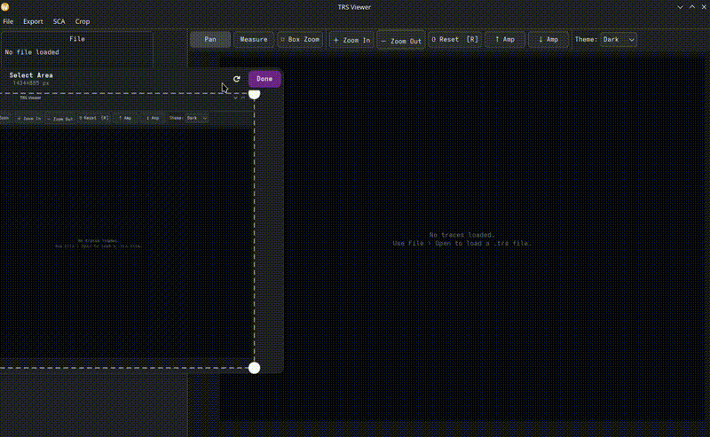

# Welch T-Test

**SCA → Run Welch T-Test…**

Computes the per-sample Welch t-statistic between two trace groups. No special header fields are required — group assignment is configured in the dialog by choosing which data byte to use as the group label (0 = group 0, non-zero = group 1). If the file's parameter map contains a `ttest` entry, its `offset` field is used automatically and the byte selector is hidden.

**Result dialog features:**
- Adjustable ±threshold line (orange dashed)
- **One-sided mode** — show only the positive threshold (for abs-preprocessed signals)
- **Calc TH…** — significance-threshold calculator. The per-sample level for an overall type-I error rate α over `n_L` samples uses the **Šidák** correction `α_TH = 1 − (1 − α)^(1/n_L)`, and the threshold is `TH = CDF_t⁻¹(1 − α_TH/2, ν̂)` with Welch–Satterthwaite degrees of freedom computed from the trace data. The dialog reports both the median and approximate ν̂. Follows Zhang, Ding, Durvaux, Standaert & Fei, *Towards Sound and Optimal Leakage Detection Procedure* (IACR ePrint 2017/287, EuroS&P 2018)
- **Style…** — set plot title, line width, trace colour, dark/light theme
- **Export PDF…** — A4 landscape vector PDF
- Export result as `.npy` or `.trs`

**SCA → Load T-Test NPY…** — load a pre-computed 1-D `float32` t-statistic vector.

