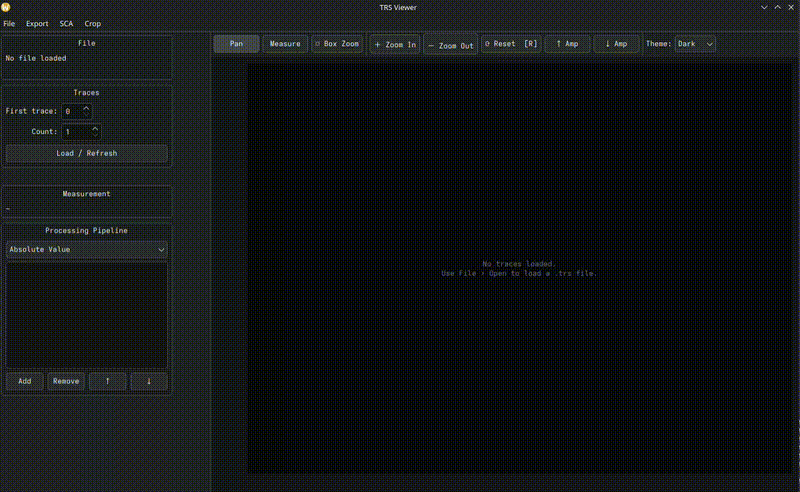

# Trace Viewing

- Load `.trs` power-trace files (Riscure format) **or** NumPy `.npy` / `.npz` trace matrices
- Multi-trace overlay with 8 distinct colours
- Pan · box-zoom · distance-measurement interaction modes
- **Y-axis zoom** — Ctrl+scroll (or Shift+scroll) to compress/expand amplitude
- Dark and light themes
- **Multiple datasets at once** — every opened file gets its own tab. Drag tabs to reorder them, or hit **⬒ Tile Tabs** to show them side by side and compare traces across files
- **Stacked view** (**☰ Stack**) — draw each trace in its own non-overlapping lane instead of overlaying them all; independent of the interaction mode
- **Undo** (Ctrl+Z) — steps back through pipeline edits, alignment and trace-range changes
- Crop ranges — mark sample regions and export as a new `.trs` file (see [Range Editor](range-editor.md))

The side panel shows file metadata (trace count, samples/trace, sample type, data bytes/trace) and a **per-trace data inspector** — use the spin box to step through traces and see their auxiliary data bytes as a hex dump. If no data bytes are present, the inspector shows `(no data)`. When the file carries the optional `LEGACY_DATA` parameter (see below), the bytes are decoded automatically as `PT` / `CT` pairs.

