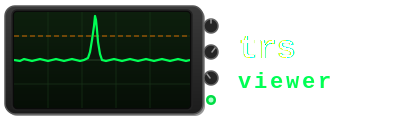

# trs-viewer

<p align="center">
  
</p>

Interactive power-trace viewer and side-channel analysis toolkit for Riscure `.trs` files and NumPy trace sets.


---

## Features

### Trace Viewing

- Load `.trs` power-trace files (Riscure format) **or** NumPy `.npy` / `.npz` trace matrices
- Multi-trace overlay with 8 distinct colours
- Pan · box-zoom · distance-measurement interaction modes
- **Y-axis zoom** — Ctrl+scroll (or Shift+scroll) to compress/expand amplitude
- Dark and light themes
- Crop ranges — mark sample regions and export as a new `.trs` file

The side panel shows file metadata (trace count, samples/trace, sample type, data bytes/trace) and a **per-trace data inspector** — use the spin box to step through traces and see their auxiliary data bytes as a hex dump. If no data bytes are present, the inspector shows `(no data)`. When the file carries the optional `LEGACY_DATA` parameter (see below), the bytes are decoded automatically as `PT` / `CT` pairs.

### Signal Processing Pipeline

Transforms stack in order and are applied live on every render and on all SCA computations:

| Transform | Description |
|---|---|
| Absolute Value | `\|x\|` point-wise |
| Negate | `-x` point-wise |
| Moving Average | Causal sliding window |
| Window Resample | Block-average decimation |
| Stride Resample | Pick every N-th sample |
| Offset | Add constant |
| Scale | Multiply by constant |

### Trace Alignment

**SCA → Align Traces…**

Align a set of traces to a reference using one of two methods:

| Method | Description |
|---|---|
| **Cross-correlation** | Finds the shift that maximises the normalised cross-correlation with the reference trace |
| **Peak alignment** | Aligns the highest-amplitude peak of each trace to the reference peak |

Configure the reference trace, the search window (±N samples), and the traces to align. Results are shown in a table and previewed in a separate plot. Click **Apply to Main View** to bake the aligned traces into the main display.

Alternatively, use the **↔ Align** drag mode in the main toolbar — drag any trace left or right to manually shift it one sample at a time.

Once alignment is applied (either method), the stored shifts are available to all SCA tools. Every SCA dialog shows an **"Apply last alignment shifts"** checkbox (pre-ticked when shifts are available) that locks the trace/sample range to the aligned values and applies per-trace shifts during analysis. Alignment state is automatically cleared when a new file is loaded or the trace set is changed.

### Welch T-Test

**SCA → Run Welch T-Test…**

Computes the per-sample Welch t-statistic between two trace groups. No special header fields are required — group assignment is configured in the dialog by choosing which data byte to use as the group label (0 = group 0, non-zero = group 1). If the file's parameter map contains a `ttest` entry, its `offset` field is used automatically and the byte selector is hidden.

**Result dialog features:**
- Adjustable ±threshold line (orange dashed)
- **One-sided mode** — show only the positive threshold (for abs-preprocessed signals)
- **Calc TH…** — Bonferroni-corrected threshold calculator using Welch-Satterthwaite degrees of freedom computed from the trace data
- **Style…** — set plot title, line width, trace colour, dark/light theme
- **Export PDF…** — A4 landscape vector PDF
- Export result as `.npy` or `.trs`

**SCA → Load T-Test NPY…** — load a pre-computed 1-D `float32` t-statistic vector.

### Cross-Correlation Matrix

**SCA → Cross-Correlation…**

Computes the M×M normalised Pearson correlation matrix `C[i,j] = Corr(sᵢ, sⱼ)`, or a rectangular search×ref matrix for template matching.

| Method | Description |
|---|---|
| **Baseline** | Streaming rank-1 outer-product updates |
| **Dual Matrix** | Gram `G = AᵀA / M` → eigen-reconstruction |
| **MP-Cleaned** | Dual Matrix + zeroes eigenvalues ≤ λ₊ (Marchenko-Pastur noise edge) |
| **Two-Window** | Rectangular search×ref cross-correlation for template matching |

A **stride** parameter subsamples before computing (`M = ⌈samples / stride⌉`) to reduce memory and computation time.

### Correlation Power Analysis (CPA)

**SCA → CPA…**

CPA correlates a user-defined leakage model with every sample column of the trace matrix and ranks the results across M hypotheses. The correlation engine uses an online accumulator — the full trace matrix is never held in RAM, making it practical for large trace sets.

**Configuration:**
- Trace range and sample range
- **M (hypotheses)** — number of key guesses to test (1–65536); for AES key byte attacks use 256, for direct data correlation set M to the data field length
- **Alignment** — apply stored alignment shifts

**Leakage model editor:**
- Python code editor with syntax highlighting and boilerplate (AES S-box + Hamming weight)
- **Test Model** — runs the model against the loaded trace data and shows the output; CPA can only be launched after a successful test
- **Load / Save** — import or export `.py` model files
- **Model library** — persistent library at `~/.local/share/trs-viewer/models/`; use the **Library** drop-down to load saved models, **Save to library…** to store new ones

Model function signature:
```python
def get_leakages(data: np.ndarray, hypothesis: int) -> np.ndarray:
    """
    data       — uint8 array, shape (n_traces, data_length)
    hypothesis — current key hypothesis (0 .. M-1)
    returns    — float32 array, shape (n_traces,)
    """
```

For direct data correlation (no key model), set M to the data field length and use `hypothesis` as a byte index:
```python
def get_leakages(data, hypothesis):
    return data[:, hypothesis].astype(np.float32)
```

For LEGACY_DATA files (PT+CT in 32 bytes), correlate against plaintext byte `b` by setting M = 16 and indexing into the first half:
```python
def get_leakages(data, hypothesis):
    # hypothesis = byte index 0..15 into plaintext
    return data[:, hypothesis].astype(np.float32)
```
Or against ciphertext (offset 16):
```python
def get_leakages(data, hypothesis):
    return data[:, 16 + hypothesis].astype(np.float32)
```

**Result window:**
- Heatmap of the M × N_samples correlation matrix
- **Top candidates** table — ranked by peak |r|, showing hypothesis value, hex (M ≤ 256), peak correlation, and sample index

### Heatmap Viewer

Interactive false-colour heatmap for correlation matrices:

- Pan (drag) · zoom (scroll wheel)
- Adjustable colour range
- **Colour schemes**: RdBu · Grayscale · Hot · Viridis · Plasma · Lukasz
- **Gaussian blur** for pattern smoothing
- **Abs value** mode and **binary threshold** on `|v|`
- Export as PNG or `.npy`

### NPY / NPZ Support

| Action | Menu |
|---|---|
| Open `.npy` or `.npz` as traces | **File → Open NPY/NPZ as traces…** |
| Export traces (pipeline applied) to `.npy` | **Export → Export traces as NPY…** |
| Export traces + data bytes to `.npz` | **Export → Export traces as NPZ…** |
| Load pre-computed 1-D t-test vector | **SCA → Load T-Test NPY…** |
| Load pre-computed 2-D heatmap matrix | **SCA → Load Heatmap NPY…** |

---

## File Formats

### TRS (Riscure Trace Set)

Standard Riscure TRS v1 format. The file begins with a sequence of TLV header tags followed by the trace data. Each trace contains optional auxiliary data bytes followed by the sample block.

Supported sample types:

| Type tag | C type | Bytes/sample |
|---|---|---|
| `0x01` | `int8_t` | 1 |
| `0x02` | `int16_t` | 2 |
| `0x04` | `int32_t` | 4 |
| `0x14` | `float32` | 4 |

Traces are read on demand — the full file is never loaded into RAM.

**Auxiliary data bytes** (per trace, optional): arbitrary bytes attached to each trace — typically plaintext, ciphertext, key material, or any other per-trace metadata. Their presence is not required; trs-viewer works fine without them. When present, they are used by the t-test for group assignment and fed as the `data` matrix to the CPA leakage model. If the header parameter map contains a `ttest` key, its `offset` field selects the group byte for the t-test automatically.

#### LEGACY_DATA (optional)

Riscure's older trace sets may store cryptographic I/O in a fixed 32-byte layout, advertised via a TRS parameter map entry with key `LEGACY_DATA`, `offset = 0`, `length = 32`. This field is entirely optional — trs-viewer auto-detects it and changes the data display, but will load and analyse any TRS file regardless of whether it is present.

```
bytes  0–15   plaintext  (PT)
bytes 16–31   ciphertext (CT)
```

When trs-viewer detects this parameter, the data inspector in the side panel displays the bytes with `PT:` and `CT:` labels instead of a raw hex dump. The bytes are still passed as-is to the CPA leakage model — `data[:, 0:16]` is the plaintext, `data[:, 16:32]` is the ciphertext.

Generating a compatible TRS file in Python (e.g. with the `trsfile` library):
```python
import trsfile, numpy as np

traces = np.random.randn(1000, 5000).astype(np.float32)
keys   = np.random.randint(0, 256, (1000, 16), dtype=np.uint8)

with trsfile.open("out.trs", "w", trs_version=1,
                  num_samples=5000, sample_coding=trsfile.SampleCoding.FLOAT) as ts:
    for t, k in zip(traces, keys):
        ts.append(trsfile.Trace(trsfile.SampleCoding.FLOAT, t, data=bytes(k)))
```

### NPY

A 2-D NumPy array file:

- **dtype**: `float32` (`<f4`, little-endian)
- **shape**: `(n_traces, n_samples)`

```python
import numpy as np
traces = np.random.randn(1000, 5000).astype(np.float32)
np.save("traces.npy", traces)
```

### NPZ

A NumPy ZIP archive with one or two arrays:

| Array key | dtype | shape | Required |
|---|---|---|---|
| `traces` | `float32` | `(n_traces, n_samples)` | Yes |
| `data` | `uint8` | `(n_traces, data_length)` | No — needed for CPA and t-test |

The archive must use **STORE** compression (no deflate):
```python
import numpy as np
traces = np.random.randn(1000, 5000).astype(np.float32)
data   = np.random.randint(0, 256, (1000, 16), dtype=np.uint8)
np.savez("traces.npz", traces=traces, data=data)
# np.savez uses STORE by default — do NOT use np.savez_compressed
```

The `data` array feeds the CPA leakage model and the t-test group assignment, equivalent to the auxiliary data bytes in a TRS file.

---

## Dependencies

| Dependency | Version | Notes |
|---|---|---|
| CMake | ≥ 3.16 | Build system |
| C++ compiler | C++17 | GCC 9+, Clang 10+, MSVC 2019+ |
| Qt | 6.x (5.x fallback) | Core · Gui · Widgets · PrintSupport |
| OpenMP | any | Parallelises correlation computation |
| Eigen3 | ≥ 3.3 | Linear algebra; auto-downloaded if not found |
| Python3 | ≥ 3.8 | CPA leakage model evaluation |
| NumPy | any | Required for CPA model I/O |

---

## Building

### 1 · Install dependencies

**Arch Linux**
```bash
sudo pacman -S base-devel cmake qt6-base eigen python python-numpy
```

**Ubuntu / Debian (22.04+)**
```bash
sudo apt install build-essential cmake qt6-base-dev libeigen3-dev \
                 python3-dev python3-numpy
```

**Fedora**
```bash
sudo dnf install gcc-c++ cmake qt6-qtbase-devel eigen3-devel \
                 python3-devel python3-numpy
```

**macOS (Homebrew)**
```bash
brew install cmake qt@6 eigen python numpy
export CMAKE_PREFIX_PATH="$(brew --prefix qt@6)"
```

### 2 · Clone and build

```bash
git clone <repo-url>
cd trs-viewer

cmake -B build -DCMAKE_BUILD_TYPE=Release
cmake --build build -j$(nproc)
```

Binary is at `build/trs-viewer`.

### 3 · Run

```bash
./build/trs-viewer                    # file picker on startup
./build/trs-viewer path/to/file.trs   # open directly
./build/trs-viewer traces.npz         # open NPZ directly
```

---

## Usage

### Opening a file

| Method | How |
|---|---|
| TRS file | **File → Open TRS file…** (Ctrl+O) or command-line argument |
| NPY (2-D trace matrix) | **File → Open NPY/NPZ as traces…** |
| NPZ archive | same — looks for `traces` array + optional `data` array |

### Navigating traces

1. Set **First trace** and **Count** in the side panel, click **Load**.
2. Scroll to zoom, drag to pan, **R** / **Reset** for full view.
3. **Ctrl+scroll** or **Shift+scroll** — Y-axis amplitude zoom.

### Interaction modes

| Button | Key | Action |
|---|---|---|
| Pan | — | Drag to pan, scroll to zoom |
| Measure | P | Click two points — reads sample index, value, and delta |
| Box Zoom | Z | Drag a rectangle to zoom into it |
| Align | — | Drag a trace left/right to manually shift it |
| Crop Select | — | Drag to add a sample range to the crop list |

### Processing pipeline

1. Pick a transform from the drop-down and click **+**.
2. Reorder with **↑ / ↓**, remove with **−**.
3. Applied live on every render and on all SCA computations.

### Exporting

| What | Where |
|---|---|
| Transformed traces → TRS | **Export → Export TRS…** |
| Trace matrix → NPY | **Export → Export traces as NPY…** |
| Trace matrix + data → NPZ | **Export → Export traces as NPZ…** |
| Plot → PNG | **Export → Export plot as PNG…** (Ctrl+Shift+S) |
| Plot → PDF | **Export → Export plot as PDF…** or **Export PDF…** in result dialogs |
| Heatmap → PNG | "Export PNG…" in heatmap dialog |
| Heatmap → NPY | "Export .npy…" in heatmap dialog |
| T-test vector → NPY | "Export .npy…" in t-test dialog |

---

## Project Layout

```
trs-viewer/
├── CMakeLists.txt
├── inc/
│   ├── mainwindow.h
│   ├── trs_file.h              # TRS + in-memory trace source
│   ├── plot_widget.h           # Interactive trace plot
│   ├── heatmap_widget.h        # Interactive correlation heatmap
│   ├── processing.h            # ITransform pipeline
│   ├── align.h                 # Trace alignment (xcorr + peak methods)
│   ├── ttest.h                 # Welch t-test accumulator
│   ├── xcorr.h                 # Cross-correlation methods
│   ├── cpa.h                   # Correlation Power Analysis
│   ├── leakage_model.h         # Python leakage model wrapper
│   └── leakage_model_dialog.h  # CPA model editor dialog
└── src/
    ├── main.cpp
    ├── mainwindow.cpp          # Main window, dialogs, NPY/NPZ I/O
    ├── trs_file.cpp            # TRS reader + openFromArray()
    ├── plot_widget.cpp         # Rendering, interaction, PDF export
    ├── heatmap_widget.cpp
    ├── processing.cpp
    ├── align.cpp
    ├── ttest.cpp
    ├── xcorr.cpp               # Baseline · Dual · MP-Cleaned · Two-Window
    ├── cpa.cpp                 # Online-accumulator CPA engine
    ├── leakage_model.cpp       # Python C API wrapper
    └── leakage_model_dialog.cpp
```
